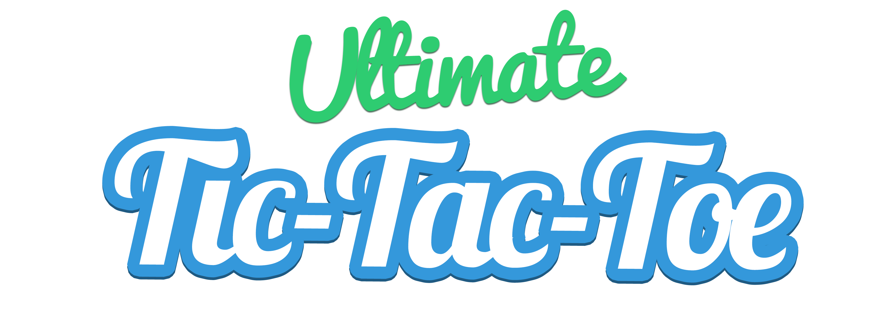

It's Tic-Tac-Toe, but with nested tic-tac-toe boards in each square, thus [making it ultimate](http://mathwithbaddrawings.com/2013/06/16/ultimate-tic-tac-toe/). Play it here: [Ultimate TicTacToe](http://www.victorszeto.com/ultimate-tictactoe).

Originally created in 24 hours for the Waterloo Facebook Hackathon, see the original repo at [shahmeernavid/Facebook-Hackathon-2014-TicCeption](https://github.com/shahmeernavid/Facebook-Hackathon-2014-TicCeption).

## Development
1. Clone this repo: 
`git clone git@github.com:VictorVation/ultimate-tictactoe.git & cd`
2. Install the our dependencies (gulp): 
`npm install`
3. Make changes in the `app` directory.
4. When you're done, build the project by using the default gulp task: `gulp`
5. Commit everything. `git commit -am "helpful commit message"`
6. Push `dist` folder to `gh-pages` to deploy: 
`git subtree push --prefix dist origin gh-pages`.
